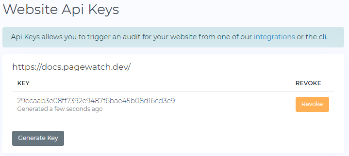

# API

## Generating an API key

To use the api you have to generate an API key from your account at [https://app.pagewatch.dev/admin/admin/api](https://app.pagewatch.dev/admin/admin/api)



## Usage
::: tip
This works automatically if you make use of the  [Netlify plugin.](https://docs.pagewatch.dev/guide/netlify.html).
:::

```js
const fetch = require('node-fetch');
const PAGEWATCH_SITE_KEY = 'XXXXXXXXXXXXXXXX';
const response = await fetch(
       'https://api.pagewatch.dev/v1/site/audit',
       {
         method: "POST",
         headers: {
           "Content-type": "application/json",
           Authorization: `Token ${PAGEWATCH_SITE_KEY}`,
           Accept: "application/json"
         },
         body: JSON.stringify({
           commit_hash: '', // optional: used in combination with the github integration
           pull_request: false,
           repo_url: '', // optional: the full url of the repo, eg 'https://github.com/lpellis/deepmodernart/'
           context: 'production',
           branch: '',  // optional: the git branch of this deploy
           trigger: 'netlify',
           base_url: '', // optional:  if you deploy to a temporary staging site you can specify it here
         })
       }
     );
```

You will receive a `json` response with the url to view the audit.
```json
// status: 200
{ 
  "reference": "xxxxxxxxxx",
  "pages": 5,
  "url": "https://app.pagewatch.dev/admin/dashboard?crawl=xxxxxxxxxx"
} 
```
