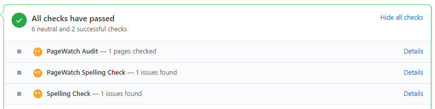

# GitHub

## Continuous integration with GitHub

You can run PageWatch as part of your continuous integration process.  On every pull request or deploy you'll be able to test your site and catch any issues before it becomes an issue.

## Installation

### 1: Install the GitHub app 

Install the GitHub app from your account at [https://app.pagewatch.dev/admin/admin/integrations](https://app.pagewatch.dev/admin/admin/integrations)

### 2: Use the CLI to run the audit and report results

This is done automatically if you use the Netlify integration.
