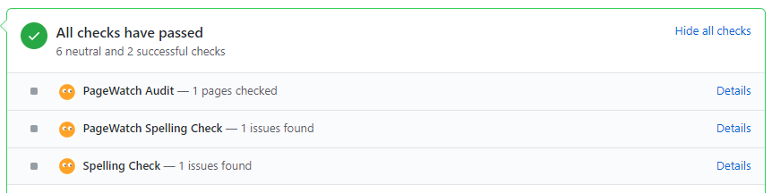

# Netlify

## Netlify build plugin

Our [Netlify build plugin](https://github.com/pagewatchdev/netlify-build-plugin-pagewatch) can run PageWatch audits automatically from pull request previews or production builds.


## Installation

1. Install the plugin using `yarn`:

```yarn add netlify-build-plugin-pagewatch```

2. Update your `netlify.toml` plugins section to reference the plugin:

```
[[plugins]]
  package = "netlify-build-plugin-pagewatch"
```


3. Grab your [PageWatch Api Key](https://docs.pagewatch.dev/guide/api.html) and store it as the `PAGEWATCH_SITE_KEY` environment variable in your [Netlify build settings](https://docs.netlify.com/configure-builds/environment-variables/).


That is it, now a PageWatch audit will be automatically run whenever you create a production build. 

## GitHub integration

You can run PageWatch as part of your continuous integration process.  On every pull request or deploy you'll be able to test your site and catch any issues before it becomes an issue.

See the [GitHub app instructions](https://docs.pagewatch.dev/guide/github.html)


